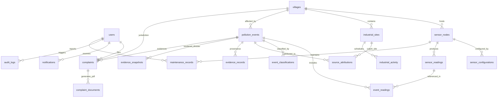

# HPEE Database Contract Specification
**Hyperlocal Pollution Evidence Engine**  
*Database: PostgreSQL 17 + PostGIS 3.5 | ORM: SQLAlchemy 2.0 | Version: v0.1*

---

## 1. Core Principles and Non-Negotiable Rules

1. **PostgreSQL + PostGIS System of Record**: All business entities, physical geography, raw telemetry, machine learning inferences, and evidence dossiers are managed within PostgreSQL with PostGIS extensions.
2. **Raw vs. Derived Separation**: Raw physical measurements (`sensor_readings`) are never mutated or overwritten by analytical processes. All machine learning classifications, backward trajectory modeling, and source attributions are persisted into dedicated derived intelligence tables.
3. **UTC TIMESTAMPTZ Everywhere**: All timestamps use PostgreSQL `TIMESTAMPTZ` (SQLAlchemy `DateTime(timezone=True)`) and are stored in UTC.
4. **PostGIS Geography(Point, 4326)**: Geographic coordinates are stored as `Geography(Point, 4326)` with explicit GIST spatial indexing. Points are constructed using longitude-first order: `ST_SetSRID(ST_MakePoint(longitude, latitude), 4326)`.
5. **Alembic Migrations**: Schema alterations must exclusively be enacted through versioned Alembic migration scripts. No manual DDL is executed directly against staging/production databases.
6. **Identifier Strategy**: Standard entities utilize `UUIDv4` primary keys (`gen_random_uuid()`). High-volume telemetry (`sensor_readings`) utilizes `BIGINT` (BIGSERIAL) to optimize B-Tree indexing and storage footprint.

---

## 2. Entity Relationship Diagram (ERD)



---

## 3. Data Lineage: From Sensor to GSPCB Complaint

```
[ ESP32 Sensor Node / Weather Station ]
                │
                ▼ (Raw Ingestion)
      ┌──────────────────┐
      │  sensor_readings │ ◄── Immutable raw telemetry observations
      └─────────┬────────┘
                │
                ▼ (Anomaly Detection Engine)
      ┌──────────────────┐
      │ pollution_events │ ◄── Identified pollution episode
      └─────────┬────────┘
                ├─────────────────────────────┬─────────────────────────────┐
                ▼ (ML Classifier)             ▼ (Gaussian Plume & Trajectory)│
      ┌───────────────────────┐     ┌───────────────────────┐               │
      │ event_classifications │     │  source_attributions  │               │
      └───────────────────────┘     └───────────────────────┘               │
                │                             │                             │
                └──────────────┬──────────────┘                             │
                               ▼ (Evidence Fusion Engine)                   │
                     ┌──────────────────┐                                   │
                     │ evidence_records │ ◄─────────────────────────────────┘
                     └─────────┬────────┘
                               ▼ (Rendering Worker)
                     ┌────────────────────┐
                     │ evidence_snapshots │ (Tamper-evident SHA-256 dossiers)
                     └─────────┬──────────┘
                               ▼ (Legal Complaint Workflow)
                     ┌──────────────────┐
                     │    complaints    │ (Pre-filled GSPCB Form-A)
                     └─────────┬────────┘
                               ▼
                     ┌─────────────────────┐
                     │ complaint_documents │ (Signed PDF exports)
                     └─────────────────────┘
```

---

## 4. Complete Table Schema Dictionary

### 4.1. `users`
Accounts for system administrators, sarpanchs, GSPCB inspectors, and citizens.

| Column Name | Type | Constraints | Description |
|---|---|---|---|
| `user_id` | `UUID` | PK, Default `gen_random_uuid()` | Unique user identifier |
| `email` | `VARCHAR(255)` | UNIQUE, NOT NULL, Index | Unique email address |
| `password_hash` | `VARCHAR(255)` | NOT NULL | Password hash |
| `full_name` | `VARCHAR(255)` | NOT NULL | User full legal name |
| `role` | `VARCHAR(32)` | NOT NULL, Default `'public'` | `admin`, `sarpanch`, `inspector`, `public` |
| `phone_number` | `VARCHAR(32)` | NULLABLE | Contact telephone |
| `is_active` | `BOOLEAN` | NOT NULL, Default `TRUE` | Account status |
| `created_at` | `TIMESTAMPTZ` | NOT NULL, Default `NOW()` | Creation timestamp |
| `updated_at` | `TIMESTAMPTZ` | NOT NULL, Default `NOW()` | Modification timestamp |

---

### 4.2. `villages`
Administrative boundaries and central geographic points for rural communities.

| Column Name | Type | Constraints | Description |
|---|---|---|---|
| `village_id` | `UUID` | PK, Default `gen_random_uuid()` | Unique village identifier |
| `name` | `VARCHAR(128)` | NOT NULL, Index | Village name |
| `district` | `VARCHAR(128)` | NOT NULL | District name (e.g. Bharuch) |
| `state` | `VARCHAR(128)` | NOT NULL, Default `'Gujarat'` | State |
| `center_location`| `Geography(Point, 4326)` | NOT NULL, GIST Index | Geographic centroid |
| `population` | `INTEGER` | NULLABLE | Population count |
| `boundary_geojson`| `JSONB` | NULLABLE | Administrative polygon boundary |
| `created_at` | `TIMESTAMPTZ` | NOT NULL, Default `NOW()` | Creation timestamp |
| `updated_at` | `TIMESTAMPTZ` | NOT NULL, Default `NOW()` | Modification timestamp |

---

### 4.3. `sensor_nodes`
Physical sensing hardware deployment registry.

| Column Name | Type | Constraints | Description |
|---|---|---|---|
| `node_id` | `VARCHAR(64)` | PK | Node code e.g. `HPEE-ANK-001` |
| `village_id` | `UUID` | FK (`villages.village_id`), Index | Associated village |
| `location` | `Geography(Point, 4326)` | NOT NULL, GIST Index | Physical installation point |
| `status` | `VARCHAR(32)` | NOT NULL, Default `'online'` | `online`, `offline`, `maintenance`, `fault` |
| `battery_percent`| `FLOAT` | CHECK (`battery_percent BETWEEN 0 AND 100`) | Battery state |
| `signal_strength`| `INTEGER` | NULLABLE | Cellular/WiFi RSSI (dBm) |
| `installed_at` | `TIMESTAMPTZ` | NULLABLE | Deployment date |
| `last_seen_at` | `TIMESTAMPTZ` | NULLABLE | Last packet timestamp |
| `created_at` | `TIMESTAMPTZ` | NOT NULL, Default `NOW()` | Creation timestamp |
| `updated_at` | `TIMESTAMPTZ` | NOT NULL, Default `NOW()` | Modification timestamp |

---

### 4.4. `sensor_configurations`
Hardware sensor calibration curves, firmware versions, and compensation parameters.

| Column Name | Type | Constraints | Description |
|---|---|---|---|
| `configuration_id`| `UUID` | PK, Default `gen_random_uuid()` | Configuration record ID |
| `node_id` | `VARCHAR(64)` | FK (`sensor_nodes.node_id`), Index | Target node |
| `sensor_type` | `VARCHAR(64)` | NOT NULL | Sensor model e.g. `PMS5003_SO2_MET` |
| `calibration_factors`| `JSONB` | NULLABLE | Calibration gains and offsets |
| `firmware_version`| `VARCHAR(32)` | NOT NULL, Default `'v1.0.0'` | Node MCU firmware |
| `is_active` | `BOOLEAN` | NOT NULL, Default `TRUE` | Whether active |
| `configured_at`| `TIMESTAMPTZ` | NOT NULL, Default `NOW()` | Configuration timestamp |
| `created_at` | `TIMESTAMPTZ` | NOT NULL, Default `NOW()` | Insert timestamp |

---

### 4.5. `sensor_readings`
High-volume time-series telemetry observations.

| Column Name | Type | Constraints | Description |
|---|---|---|---|
| `reading_id` | `BIGINT` | PK, BIGSERIAL / Identity | Sequential reading sequence |
| `node_id` | `VARCHAR(64)` | FK (`sensor_nodes.node_id`), NOT NULL | Origin node |
| `recorded_at` | `TIMESTAMPTZ` | NOT NULL | Node clock timestamp (UTC) |
| `received_at` | `TIMESTAMPTZ` | NOT NULL, Default `NOW()` | Ingestion timestamp (UTC) |
| `location` | `Geography(Point, 4326)` | NULLABLE, GIST Index | Optional reading location |
| `pm25` | `FLOAT` | CHECK (`pm25 >= 0.0`) | PM2.5 (ug/m3) |
| `pm25_quality` | `VARCHAR(32)` | NOT NULL, Default `'valid'` | `valid`, `estimated`, `suspect`, `invalid` |
| `so2` | `FLOAT` | CHECK (`so2 >= 0.0`) | SO2 (ug/m3 or ppb) |
| `so2_quality` | `VARCHAR(32)` | NOT NULL, Default `'valid'` | `valid`, `estimated`, `suspect`, `invalid` |
| `temperature` | `FLOAT` | NULLABLE | Ambient temp (°C) |
| `humidity` | `FLOAT` | CHECK (`humidity BETWEEN 0.0 AND 100.0`) | Relative humidity (%) |
| `wind_speed` | `FLOAT` | CHECK (`wind_speed >= 0.0`) | Wind velocity (m/s) |
| `wind_direction`| `FLOAT` | CHECK (`wind_direction >= 0.0 AND < 360.0`)| Wind bearing (deg) |
| `raw_payload` | `JSONB` | NULLABLE | Unaltered packet for provenance |
| `created_at` | `TIMESTAMPTZ` | NOT NULL, Default `NOW()` | Ingestion timestamp |

**Indexes**:
- `ix_sensor_readings_node_recorded` ON `(node_id, recorded_at DESC)`
- `ix_sensor_readings_recorded_at` ON `(recorded_at DESC)`

---

### 4.6. `pollution_events`
Flagged abnormal pollution episodes with severity ratings and temporal duration.

| Column Name | Type | Constraints | Description |
|---|---|---|---|
| `event_id` | `UUID` | PK, Default `gen_random_uuid()` | Event identifier |
| `village_id` | `UUID` | FK (`villages.village_id`), Index | Primary affected village |
| `detected_at` | `TIMESTAMPTZ` | NOT NULL | Algorithm detection time |
| `started_at` | `TIMESTAMPTZ` | NOT NULL | Estimated plume onset |
| `ended_at` | `TIMESTAMPTZ` | NULLABLE | Estimated plume conclusion |
| `severity` | `VARCHAR(32)` | NOT NULL, Default `'medium'` | `low`, `medium`, `high`, `severe` |
| `peak_pm25` | `FLOAT` | NULLABLE | Max PM2.5 during event |
| `peak_so2` | `FLOAT` | NULLABLE | Max SO2 during event |
| `status` | `VARCHAR(32)` | NOT NULL, Default `'active'` | `active`, `resolved`, `false_positive`, `under_investigation` |
| `description` | `TEXT` | NULLABLE | Context narrative |
| `created_at` | `TIMESTAMPTZ` | NOT NULL, Default `NOW()` | Creation timestamp |
| `updated_at` | `TIMESTAMPTZ` | NOT NULL, Default `NOW()` | Modification timestamp |

---

### 4.7. `event_readings`
Many-to-many junction binding pollution events to specific raw sensor readings.

| Column Name | Type | Constraints | Description |
|---|---|---|---|
| `event_id` | `UUID` | PK, FK (`pollution_events.event_id` ON DELETE CASCADE) | Event identifier |
| `reading_id` | `BIGINT` | PK, FK (`sensor_readings.reading_id` ON DELETE CASCADE) | Sensor reading identifier |

---

### 4.8. `industrial_sites`
Industrial manufacturing plants and potential emission sources.

| Column Name | Type | Constraints | Description |
|---|---|---|---|
| `industry_id` | `UUID` | PK, Default `gen_random_uuid()` | Industrial site ID |
| `name` | `VARCHAR(255)` | NOT NULL, Index | Company name |
| `industry_type`| `VARCHAR(128)` | NOT NULL | Sector (e.g. Dyes, Agrochemicals) |
| `gspcb_consent_id`| `VARCHAR(64)` | UNIQUE, NULLABLE | GSPCB CCA / CTO consent reference |
| `location` | `Geography(Point, 4326)` | NOT NULL, GIST Index | Factory stack location |
| `address` | `TEXT` | NULLABLE | Postal / GIDC plot address |
| `village_id` | `UUID` | FK (`villages.village_id`), Index | Nearest village |
| `is_active` | `BOOLEAN` | NOT NULL, Default `TRUE` | Operational flag |
| `created_at` | `TIMESTAMPTZ` | NOT NULL, Default `NOW()` | Creation timestamp |
| `updated_at` | `TIMESTAMPTZ` | NOT NULL, Default `NOW()` | Modification timestamp |

---

### 4.9. `industrial_activity`
Operational logs, production shifts, and scheduled maintenance windows.

| Column Name | Type | Constraints | Description |
|---|---|---|---|
| `activity_id` | `UUID` | PK, Default `gen_random_uuid()` | Activity record ID |
| `industry_id` | `UUID` | FK (`industrial_sites.industry_id`), Index | Industrial site |
| `shift_name` | `VARCHAR(64)` | NULLABLE | Shift label / batch process |
| `start_time` | `TIMESTAMPTZ` | NOT NULL | Activity start UTC |
| `end_time` | `TIMESTAMPTZ` | NULLABLE | Activity end UTC |
| `declared_operating_status`| `VARCHAR(64)`| NOT NULL, Default `'normal_operations'` | Status |
| `estimated_emission_factor`| `FLOAT` | NULLABLE | Relative emission multiplier |
| `notes` | `TEXT` | NULLABLE | Additional context |
| `created_at` | `TIMESTAMPTZ` | NOT NULL, Default `NOW()` | Creation timestamp |

---

### 4.10. `weather_observations`
External meteorological observations from weather stations or IMD grids.

| Column Name | Type | Constraints | Description |
|---|---|---|---|
| `weather_id` | `UUID` | PK, Default `gen_random_uuid()` | Weather record ID |
| `recorded_at` | `TIMESTAMPTZ` | NOT NULL, Index | Observation UTC timestamp |
| `location` | `Geography(Point, 4326)` | NOT NULL, GIST Index | Weather station location |
| `temperature` | `FLOAT` | NULLABLE | Temp (°C) |
| `humidity` | `FLOAT` | CHECK (`humidity BETWEEN 0.0 AND 100.0`) | Humidity (%) |
| `wind_speed` | `FLOAT` | CHECK (`wind_speed >= 0.0`) | Velocity (m/s) |
| `wind_direction`| `FLOAT` | CHECK (`wind_direction >= 0.0 AND < 360.0`)| Bearing (deg) |
| `pressure` | `FLOAT` | NULLABLE | Barometric pressure (hPa) |
| `source_provider`| `VARCHAR(64)`| NOT NULL, Default `'IMD_OR_MET'` | Source name |
| `created_at` | `TIMESTAMPTZ` | NOT NULL, Default `NOW()` | Insert timestamp |

---

### 4.11. `event_classifications`
Machine learning classifier outputs inferring pollution emission category.

| Column Name | Type | Constraints | Description |
|---|---|---|---|
| `classification_id`| `UUID` | PK, Default `gen_random_uuid()` | Classification ID |
| `event_id` | `UUID` | FK (`pollution_events.event_id`), Index | Target event |
| `classification_type`| `VARCHAR(64)`| NOT NULL | `industrial`, `agricultural_burning`, `vehicular`, `seasonal_inversion`, `unknown` |
| `confidence_score`| `FLOAT` | CHECK (`confidence_score BETWEEN 0.0 AND 1.0`) | Model probability |
| `model_version`| `VARCHAR(64)` | NOT NULL | ML model version tag |
| `features_used`| `JSONB` | NULLABLE | Explainability feature vector |
| `classified_at`| `TIMESTAMPTZ` | NOT NULL, Default `NOW()` | Execution timestamp |
| `created_at` | `TIMESTAMPTZ` | NOT NULL, Default `NOW()` | Insert timestamp |

---

### 4.12. `source_attributions`
Ranked spatial-meteorological probability distribution of culprit industrial facilities.

| Column Name | Type | Constraints | Description |
|---|---|---|---|
| `attribution_id`| `UUID` | PK, Default `gen_random_uuid()` | Attribution ID |
| `event_id` | `UUID` | FK (`pollution_events.event_id`), Index | Target event |
| `industry_id` | `UUID` | FK (`industrial_sites.industry_id`), Index | Probable facility |
| `rank` | `INTEGER` | NOT NULL | Culprit rank (1 = highest) |
| `probability_score`| `FLOAT`| CHECK (`probability_score BETWEEN 0.0 AND 1.0`)| Attribution probability |
| `plume_model_params`| `JSONB`| NULLABLE | AERMOD / Gaussian plume trajectory parameters |
| `calculated_at`| `TIMESTAMPTZ` | NOT NULL, Default `NOW()` | Calculation timestamp |
| `created_at` | `TIMESTAMPTZ` | NOT NULL, Default `NOW()` | Insert timestamp |

---

### 4.13. `evidence_records`
Atomic facts, sensor spikes, wind vectors, and correlations for legal evidence fusion.

| Column Name | Type | Constraints | Description |
|---|---|---|---|
| `evidence_id` | `UUID` | PK, Default `gen_random_uuid()` | Evidence record ID |
| `event_id` | `UUID` | FK (`pollution_events.event_id`), Index | Associated event |
| `evidence_type`| `VARCHAR(64)` | NOT NULL | `sensor_spike`, `wind_vector_alignment`, `industrial_schedule_match`, `satellite_hotspot`, `weather_inversion` |
| `data_payload` | `JSONB` | NOT NULL | Structured evidence proof values |
| `confidence_weight`| `FLOAT` | CHECK (`confidence_weight BETWEEN 0.0 AND 1.0`)| Weight in composite score |
| `created_at` | `TIMESTAMPTZ` | NOT NULL, Default `NOW()` | Insert timestamp |

---

### 4.14. `evidence_snapshots`
Tamper-evident rendered map visualizations, time-series charts, and composite dossiers.

| Column Name | Type | Constraints | Description |
|---|---|---|---|
| `snapshot_id` | `UUID` | PK, Default `gen_random_uuid()` | Snapshot ID |
| `event_id` | `UUID` | FK (`pollution_events.event_id`), Index | Associated event |
| `snapshot_type`| `VARCHAR(64)` | NOT NULL | `plume_map`, `time_series_chart`, `wind_rose`, `composite_dossier` |
| `file_path` | `VARCHAR(512)`| NOT NULL | Object storage / file path |
| `file_hash` | `VARCHAR(128)`| NOT NULL | SHA-256 hash of image file |
| `generated_at` | `TIMESTAMPTZ` | NOT NULL, Default `NOW()` | Render timestamp |
| `metadata_json`| `JSONB` | NULLABLE | Render bounds & layers |
| `created_at` | `TIMESTAMPTZ` | NOT NULL, Default `NOW()` | Insert timestamp |

---

### 4.15. `complaints`
Formal GSPCB environmental complaint records and filing lifecycle.

| Column Name | Type | Constraints | Description |
|---|---|---|---|
| `complaint_id` | `UUID` | PK, Default `gen_random_uuid()` | Complaint ID |
| `complaint_number`| `VARCHAR(64)` | UNIQUE, NOT NULL, Index | Tracking code e.g. `GSPCB-HPEE-2026-001` |
| `event_id` | `UUID` | FK (`pollution_events.event_id`), Index | Correlated event |
| `filed_by_user_id`| `UUID` | FK (`users.user_id`), Index | Complainant user |
| `village_id` | `UUID` | FK (`villages.village_id`), Index | Jurisdiction |
| `gspcb_form_data`| `JSONB` | NOT NULL | Form-A JSON payload |
| `status` | `VARCHAR(32)` | NOT NULL, Default `'draft'` | `draft`, `submitted`, `under_review`, `action_taken`, `closed`, `rejected` |
| `submission_reference`| `VARCHAR(128)`| NULLABLE | External GSPCB tracking ID |
| `submitted_at` | `TIMESTAMPTZ` | NULLABLE | Submission timestamp |
| `created_at` | `TIMESTAMPTZ` | NOT NULL, Default `NOW()` | Creation timestamp |
| `updated_at` | `TIMESTAMPTZ` | NOT NULL, Default `NOW()` | Modification timestamp |

---

### 4.16. `complaint_documents`
Exported and digitally signed PDF documents for GSPCB submission.

| Column Name | Type | Constraints | Description |
|---|---|---|---|
| `document_id` | `UUID` | PK, Default `gen_random_uuid()` | Document ID |
| `complaint_id` | `UUID` | FK (`complaints.complaint_id`), Index | Associated complaint |
| `generated_by_user_id`| `UUID` | FK (`users.user_id`), NOT NULL | Generating user |
| `version_number`| `INTEGER` | NOT NULL, Default `1` | Version number |
| `file_path` | `VARCHAR(512)`| NOT NULL | Storage path |
| `file_hash` | `VARCHAR(128)`| NOT NULL | SHA-256 hash of PDF |
| `document_type`| `VARCHAR(64)` | NOT NULL, Default `'gspcb_form_a_pdf'` | `gspcb_form_a_pdf`, `evidence_annexure_pdf` |
| `generated_at` | `TIMESTAMPTZ` | NOT NULL, Default `NOW()` | Render timestamp |
| `created_at` | `TIMESTAMPTZ` | NOT NULL, Default `NOW()` | Insert timestamp |

---

### 4.17. `notifications`
Multi-channel alerts dispatched to village Sarpanchs, citizens, and inspectors.

| Column Name | Type | Constraints | Description |
|---|---|---|---|
| `notification_id`| `UUID` | PK, Default `gen_random_uuid()` | Notification ID |
| `recipient_user_id`| `UUID` | FK (`users.user_id`), Index | Optional registered user |
| `recipient_contact`| `VARCHAR(255)`| NOT NULL | Phone/Email/Token |
| `channel` | `VARCHAR(32)` | NOT NULL | `sms`, `whatsapp`, `email`, `web_push` |
| `notification_type`| `VARCHAR(64)`| NOT NULL | `pollution_alert`, `complaint_status`, `maintenance_alert` |
| `title` | `VARCHAR(255)`| NOT NULL | Notification title |
| `message_body` | `TEXT` | NOT NULL | Message body |
| `status` | `VARCHAR(32)` | NOT NULL, Default `'pending'` | `pending`, `sent`, `delivered`, `failed` |
| `sent_at` | `TIMESTAMPTZ` | NULLABLE | Transmission timestamp |
| `created_at` | `TIMESTAMPTZ` | NOT NULL, Default `NOW()` | Insert timestamp |

---

### 4.18. `maintenance_records`
Hardware defect tracking and technician work orders.

| Column Name | Type | Constraints | Description |
|---|---|---|---|
| `maintenance_id`| `UUID` | PK, Default `gen_random_uuid()` | Maintenance ticket ID |
| `node_id` | `VARCHAR(64)` | FK (`sensor_nodes.node_id`), Index | Defective node |
| `reported_by_user_id`| `UUID` | FK (`users.user_id`), NULLABLE | Reporter |
| `issue_type` | `VARCHAR(64)` | NOT NULL | `offline`, `calibration_drift`, `physical_damage`, `battery_failure`, `unknown` |
| `description` | `TEXT` | NULLABLE | Problem details |
| `status` | `VARCHAR(32)` | NOT NULL, Default `'open'` | `open`, `in_progress`, `resolved`, `cancelled` |
| `scheduled_date`| `TIMESTAMPTZ`| NULLABLE | Field technician visit |
| `resolved_at` | `TIMESTAMPTZ` | NULLABLE | Resolution timestamp |
| `notes` | `TEXT` | NULLABLE | Repair notes |
| `created_at` | `TIMESTAMPTZ` | NOT NULL, Default `NOW()` | Creation timestamp |
| `updated_at` | `TIMESTAMPTZ` | NOT NULL, Default `NOW()` | Modification timestamp |

---

### 4.19. `audit_logs`
Immutable traceability log of user actions and automated engine executions.

| Column Name | Type | Constraints | Description |
|---|---|---|---|
| `audit_id` | `UUID` | PK, Default `gen_random_uuid()` | Audit log ID |
| `user_id` | `UUID` | FK (`users.user_id`), Index | Actor user ID (null for system jobs) |
| `action` | `VARCHAR(128)`| NOT NULL | Action identifier |
| `entity_type` | `VARCHAR(64)` | NOT NULL | Entity table affected |
| `entity_id` | `VARCHAR(128)`| NOT NULL | Target entity primary key |
| `changes` | `JSONB` | NULLABLE | Before/After delta JSON |
| `ip_address` | `VARCHAR(64)` | NULLABLE | Client IP |
| `created_at` | `TIMESTAMPTZ` | NOT NULL, Default `NOW()` | Event timestamp |
