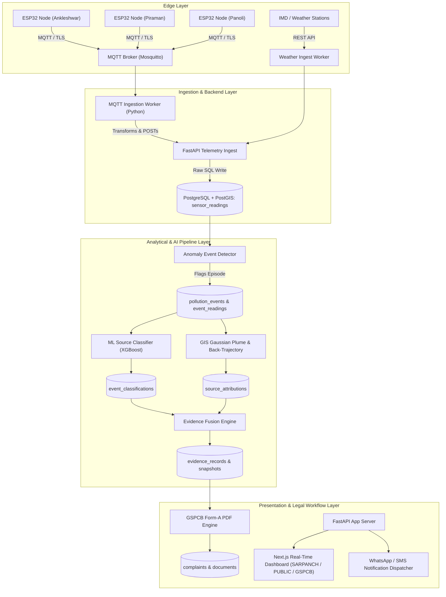

# HPEE System Architecture Specification
**Hyperlocal Pollution Evidence Engine**  
*Architecture Overview, Ingestion Pipelines & Intelligence Fusion*

---

## 1. High-Level Architecture Topology

---

## 2. Core Architectural Guarantees

### 2.1. Raw vs. Derived Data Integrity
- **Raw Measurements**: `sensor_readings` and `weather_observations` are strictly append-only. No analytical routine, ML model, or user edit is permitted to alter raw telemetry.
- **Derived Intelligence**: All analytical artifacts (`pollution_events`, `event_classifications`, `source_attributions`, `evidence_records`, `evidence_snapshots`, and `complaints`) reference the raw observations via explicit foreign keys.

### 2.2. Reproducibility and Version Control
- All schema alterations are versioned via Alembic migrations.
- ML classifications preserve the exact model version (`model_version`) and explainability feature vectors (`features_used`).
- Evidence snapshots and PDF documents store cryptographic SHA-256 hashes (`file_hash`) to guarantee chain-of-custody and tamper-evident integrity for legal proceedings before the National Green Tribunal (NGT) or GSPCB.
